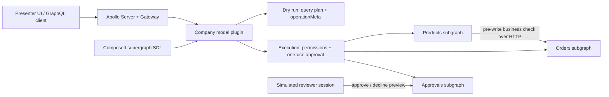

# Your graph is a company model

[View the talk slides](https://2026-apollo-summit-graphql-company-model.pages.dev/)

A generic product-management demo for Apollo Summit 2026: three Apollo Federation
subgraphs and gateway plugins that make permissions, approvals, and errors
discoverable through the graph. All products, orders, and identities are fictional.

The demo runs locally without a model, Docker, external business API, GraphOS key,
or Router license. Gateway telemetry is disabled.

## Run

Requires Node.js 22 or newer and npm.

```sh
git clone https://github.com/jwondrusch/apollo-summit-2026-demo.git
cd apollo-summit-2026-demo
npm ci
npm start
```

Open **http://127.0.0.1:4000** for the presenter UI. GraphQL is at
**http://127.0.0.1:4000/graphql**. Subgraphs listen on loopback ports 4001–4003;
access them through the gateway. Stop with Ctrl-C. State resets on restart or
through **Reset demo data**. `PORT` changes the gateway port.

```sh
npm test        # Integration tests; ephemeral ports, independent of npm start
npm run demo    # CLI walkthrough; simulates the reviewer's decision
npm run compose # Write generated/supergraph.graphql with local routing URLs
```

Dependencies are pinned and locked. The generated directory is disposable.

## Present it

1. **Find the duplicates → Execute.** A registered query returns products,
   variants, services, and related open orders. The canonical Desk Lamp is
   `PRODUCT_001`; `PRODUCT_002` and `PRODUCT_003` are duplicate product records.
2. **See which door is open → Dry run.** As the editor, archiving is allowed;
   deletion is denied with `reason: "admin only"`. View **Metadata**. Switch to
   admin and dry-run again to evaluate the same schema for another caller.
3. Return to **editor → Preview the write → Dry run**. View **Query plan** to see
   `products → Flatten → orders`, and **Metadata** for approval, docs, and skill.
   Subgraph counters do not change during a dry run.
4. **Execute** without approval. The plugin returns `APPROVAL_REQUIRED` before
   any subgraph receives the write.
5. **Request approval.** Review the exact document and variables in the reviewer
   panel, then click **Reviewer: approve**. The panel simulates a separate admin
   session. Requesting approval never grants it automatically.
6. **Execute** the unchanged operation. Two duplicates archive; `PRODUCT_004`
   stays active because a variant is in `ORDER_001`. The response contains both
   success counts and an actionable error. Execute again to see replay denied.
7. **Find the duplicates → Execute** to verify archived state. Reset for another run.

The CLI walkthrough follows the same sequence and asserts its outcomes. It
explicitly simulates human approval automatically; the browser waits for a click.

## Model and architecture

| Type | Meaning |
| --- | --- |
| `Product` | A physical product with an ID, name, archived state, and variants |
| `ProductVariant` | A size or color with its own SKU and price in cents |
| `Service` | Work such as installation, distinct from a physical product |
| `Order` | An order referencing product variants |
| `ApprovalRequest` | A preview and decision for an exact operation and variables |



The three subgraphs have separate HTTP endpoints and real composition, entity
resolution, and gateway execution. One Node process hosts them for easy stage setup.
Products owns `Product`, `ProductVariant`, and `Service`; orders extends `Product`
with `openOrders`; approvals owns the request and token lifecycle. The approval
store is shared with the gateway plugin inside this process.

The Apollo Server plugin uses `responseForOperation` to return a dry run before
Gateway executes. Apollo's federation query planner supplies the real plan.
Metadata comes from directive applications preserved in the **composed supergraph**.
This implementation uses Gateway plugins; it is not a Rust Router plugin or an
HTTP coprocessor implementation.

## Behaviors and implementation

| Behavior | Implementation |
| --- | --- |
| Discover typed operations and meaning | [Products SDL](schema/products.graphql): descriptions, search inputs, an offering union, and product-only search |
| Use curated operations and workflow guidance | [Operations](operations/), [registry](src/registry.js), and [products skill](skills/products/SKILL.md) |
| Report partial success precisely | [Products resolvers](src/products.js) + [partial-success plugin](src/plugins.js): counts, successful products, response paths, and input paths |
| Preview permissions before execution | [Operation inspector](src/operation-meta.js): evaluates composed `@permission` annotations for the caller |
| Plan without executing | `Apollo-Expose-Query-Plan: dry-run` returns a query plan and `extensions.operationMeta`; zero subgraph calls |
| Require a human decision | `@requiresApproval`, [approval service](src/approvals.js), reviewer decision, and one-use token on `x-approval` |
| Expose pointers to further guidance | [Shared directives](schema/agent.graphql): `@docs` and `@skill`, preserved with `@link` and `@composeDirective` |

## Requests

Inspect the local registry at `GET /api/operations`. Its named-operation protocol
is demo-specific; it is not GraphOS PQL, APQ, or Apollo MCP Server.

```sh
curl -s http://127.0.0.1:4000/graphql \
  -H 'content-type: application/json' \
  -H 'x-demo-user: editor' \
  -H 'Apollo-Expose-Query-Plan: dry-run' \
  --data '{"extensions":{"registeredOperation":"ArchiveProducts"},"variables":{"products":[{"id":"PRODUCT_002","reason":"DUPLICATE_OF PRODUCT_001"}]}}'
```

Standard `{query, variables, operationName}` requests also work. Unknown registered
names and requests mixing a registered name with a document are rejected.
Operation descriptions live in the registry and `.graphql` comments because the
pinned GraphQL.js 16 runtime does not parse operation-description string syntax.

An example metadata entry:

```json
{
  "Mutation.archiveProducts": {
    "permissions": ["products:write"],
    "allowed": true,
    "approval": {
      "required": true,
      "via": "Mutation.requestApproval",
      "message": "Approval required. Call requestApproval with this document and variables."
    },
    "docs": "/docs/products.md",
    "skill": "products"
  }
}
```

Only fields in the selected operation are reported, including nested selections.
The inspector handles aliases, named/inline fragments, `@skip`, `@include`, and
coerced variable defaults. Policies use schema coordinates, independent of aliases.
Denied execution rejects the whole operation before any mutation starts.
The plan may contain conditional branches; metadata evaluates the supplied variables.

For a bulk error, `errors[].path` locates the response field, including its alias.
`extensions.inputPath: "products[2].id"` identifies the submitted input, while
`entityPath: "variants[0]"` identifies related product data. `code`, `retryable`,
`productId`, `orderIds`, and `docs` help the caller decide what to do next.

## Demo boundaries

- `x-demo-user` selects editor, admin, or viewer. These are simulated identities,
  not authentication. The reviewer panel acts as admin. All listeners bind to
  loopback; direct subgraph requests require a random internal header.
- Data and approvals live in memory. Tokens bind to the caller, selected operation,
  printed document, and coerced variables. They expire in five minutes and are
  consumed before execution. Changed input, another caller, and replay fail.
- The custom `@permission` directive demonstrates scope checks. It does not
  implement Router-native `@policy` or `@requiresScopes` semantics.
- Dry-run previews routing and field policy, not product existence, open orders,
  future state, or a transactional simulation. The products service independently
  checks orders before writing, even if `openOrders` is not selected. The plan's
  post-mutation orders fetch only populates the response.
- Archive batches contain 1–25 products. Expected per-product failures preserve
  successes; a downstream outage before checks finish prevents all writes.
- Production requires verified identities, resource authorization, durable atomic
  approval consumption, and concurrency control across order checks and product
  writes. Subscriptions are unsupported.

The initial locked dependency audit reports 21 findings (18 moderate, 3 high),
including Gateway's transitive `http-cache-semantics` dependency. No forced
downgrades or unverified overrides were applied. This is a localhost demo.

## References and verification

- [Apollo Server plugin lifecycle](https://www.apollographql.com/docs/apollo-server/integrations/plugins-event-reference)
- [Federation directives and composition](https://www.apollographql.com/docs/graphos/schema-design/federated-schemas/reference/directives)
- [Gateway with Apollo Server](https://www.apollographql.com/docs/apollo-server/using-federation/apollo-gateway-setup)

Tests cover real HTTP federation, dry-run isolation, metadata, permissions,
partial data and errors, aliases/fragments/defaults, malformed requests, approval
binding/expiry/replay, reviewer decline, batch limits, direct subgraph bypass,
and downstream failure before writes. The CLI walkthrough exercises the complete flow.
